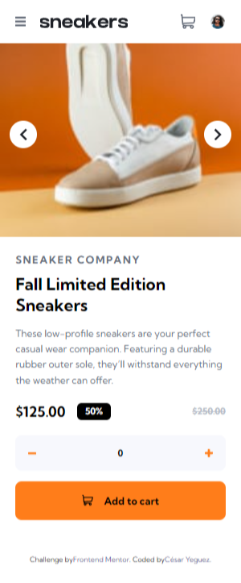
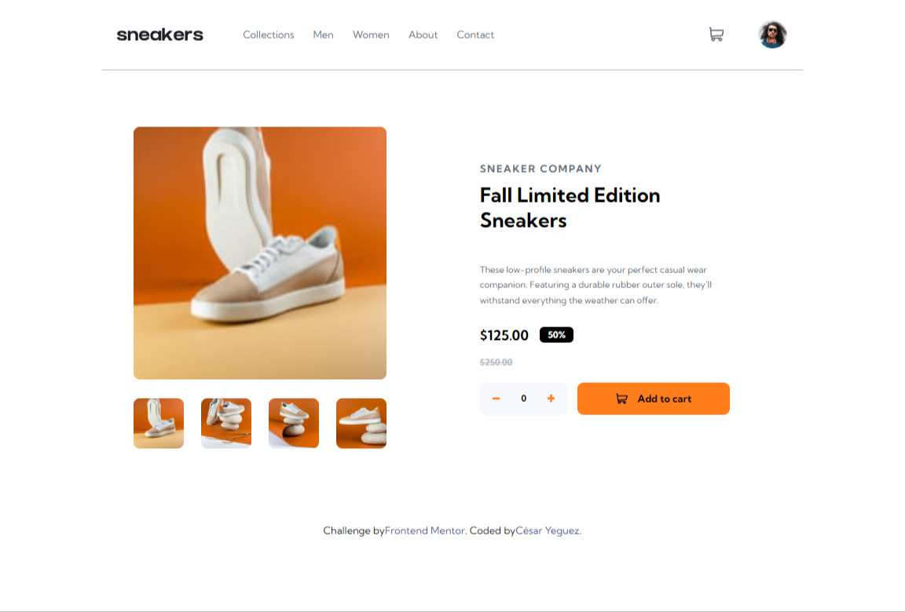

# Frontend Mentor - E-commerce product page solution

This is a solution to the [E-commerce product page challenge on Frontend Mentor](https://www.frontendmentor.io/challenges/ecommerce-product-page-UPsZ9MJp6). Frontend Mentor challenges help you improve your coding skills by building realistic projects.

## Table of contents

- [Overview](#overview)
  - [The challenge](#the-challenge)
  - [Screenshot](#screenshot)
  - [Links](#links)
- [My process](#my-process)
  - [Built with](#built-with)
  - [What I learned](#what-i-learned)
- [Author](#author)

**Note: Delete this note and update the table of contents based on what sections you keep.**

## Overview

### The challenge

Users should be able to:

- View the optimal layout for the site depending on their device's screen size
- See hover states for all interactive elements on the page
- Open a lightbox gallery by clicking on the large product image
- Switch the large product image by clicking on the small thumbnail images
- Add items to the cart
- View the cart and remove items from it

### Screenshot

### Links

- Solution URL: [Add solution URL here](https://your-solution-url.com)
- Live Site URL: [Add live site URL here](https://your-live-site-url.com)

## My process

- Colocación de las etiquetas HTML
- Buscar las medidas del diseño sumistrado
- Creación de css
- Formulación de la lógica a traves de JS.

### Built with

- Semantic HTML5 markup
- SASS
- Flexbox
- CSS Grid
- Mobile-first workflow

### What I learned

- Aprendí lo importante de formular con cuidado el html, Este si esta bien organizado permite la flexibilidad y el ajuste correcto a las necesidades requeridas.
- Apredí que la resolución de un problema tiene diversas formas de resolver, una mas sencillas que otras.

## Author

- Website - [César Yeguez](https://www.your-site.com)
- Frontend Mentor - [@cyeguez](https://www.frontendmentor.io/profile/yourusername)
